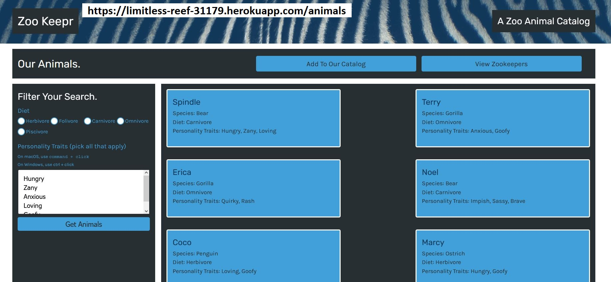

# zookeepr

## Description :
City requested to create back end server that will allow the front end to make AJAX request to the server

* The requirement from city is as follow :

1. Create a web server that allows user to request a list of all animal data. User should be able to do this from anywhere

1. User should be able to add new animal data to the catalog

1. User should be able to view data from the server in a front-end web application and it should allow to create new data by submitting an HTML form 

1. User should be able to access and create different types of data stored on the server

## Languages and other components used : 
   * Node.js 
   * FS (File systems) 
   * npm (node package manager) 
   * Expess.js server ( Node based web server ) 
   * Jest ( for tests )
   * routes ( GET, POST, etc ) 
   * Heroku ( to deploy the server )
   * middleware ( to accept incoming data )

## How to install : 
 
 To install the application in your computer follow the steps below: 
 
 1. Clone the repository in your computer :
    - open the command line and go to the directory where you want to clone the repository.
    - then clone the repo by typing : " git clone git@github.com:miraj00/zookeepr.git "

 2. Install node.js on your computer by going to https://nodejs.org/en/  
 
 3. Once node.js is installed, type "npm init" on the cammand line Terminal at root directory.
    - This will initiate npm packages

 4. Install Jest by typing " npm install jest --save-dev " in command line.    

 4. Create Express.js server by typing : "npm install express" on the command line
     Then, in server.js file add :
       1) const express = require('express');  
       2) const app = express();
       3) app.listen(3001, () => { console.log(`API server now on port 3001!`); });

       After that, you can run " npm start " in terminal and make sure it shows the message " API server now on port 3001! " in the console.

                 
 6. Once above steps are done, the application is ready to use.

## How to use application : 
You can use this application to generate Team Profile in HTML file. Once you follow the installation process as described above,
 
 1. You can verify if test passes by typing : " npm run test " in command line
 
 2. You can go to following links in web-browser to acess html pages

  - https://limitless-reef-31179.herokuapp.com/
  - https://limitless-reef-31179.herokuapp.com/animals
  - https://limitless-reef-31179.herokuapp.com/zookeepers
  

## Below is the screenshot and Deployed application of the Project as per client request ## 

[Please click here to deploy application](https://github.com/miraj00/zookeepr)
